# Editor Interface Functionality

## User Input 

When the program starts running, three inputs are asked to be given by the user:
1. 'Name of the target' : Enter the common name of the object you want to hop to (if any) or hit enter 
2. 'RA/DEC of the target': Enter the J2000 RA/DEC coordinates of the object you want to hop to in this format and will appear as a yellow mark in the plot. Example: '200/20'. Default value is 0/0
3. 'Limiting Magnitude' : Enter the maximum 'V' band AB apparent magnitude of the objects visible in the plot. Should be a positive integer. Keeping only the bright stars help in creating a sensible hopping sequence. Default is 25.

## Hopping and Plot Controls

Once all inputs are given, the final plot will launch in a new browser window. Your entered target will appear as a yellow '+' mark. CLusters, Messier objects and stars are represented with different markers. Cursor hovering on the objects will show their RA/DEC/Contellation tags. **Clicking on the plot stores the hop with a pop-up** You can modify the choice of hops using the buttons on the left. You can adjust the view of the sky around the target using the control buttons on bottom-left of the plot.
The features of the plot are described below:

### 1. Controls
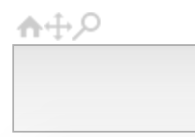

* **Home View** : When clicked, rings back the zoomed-in/zoomed-out plot to the full view which is the entire sky map conatining all RA/DECs. 

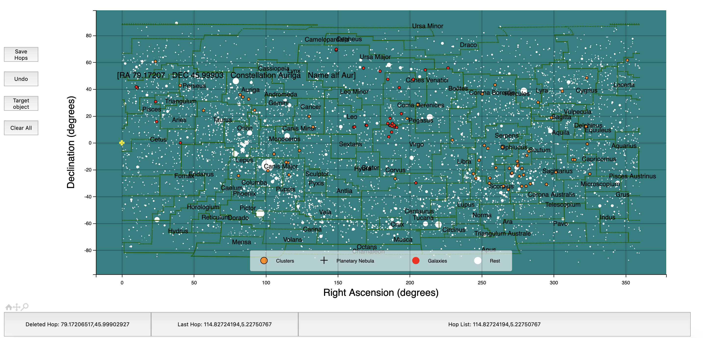

* **Pan zoom** : When clicked, the default cursor changes and touchpad/mouse motions can be used to zoom-in/zoom-out the view on the plot. (**NOTE**: Do not create hops with this, always double-click the icon first to get the default cursor and then click for hops) 

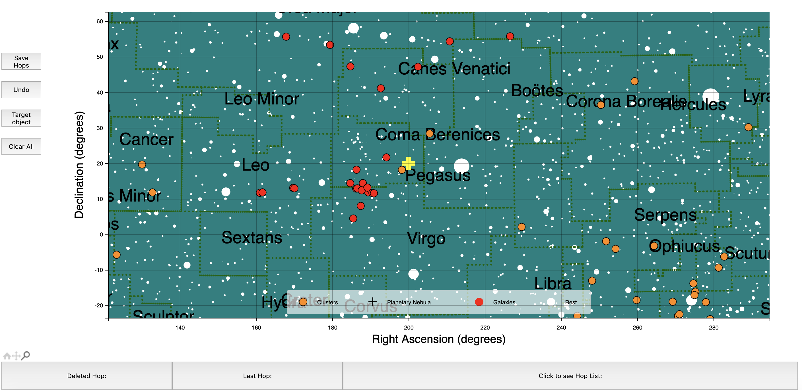

* **Zoom-to-rectangle** : When clicked, allows you to select a region of the full sky-map near the target, very useful in creating hops in a given region of RA/DEC

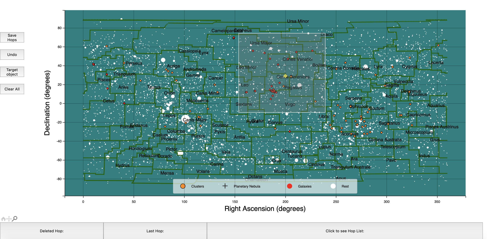

Double clicking the controls will bring the default mouse cursor back.

### 2. Buttons
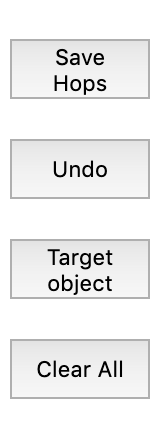

* **Save Hops** : Once you are satisfied with your selection of hop sequence, hit this button, two window prompts will pop up for saving two text files (depends on browser settings) - a. Asking the set of instructions you want to save with the hops, the name of the file, target location for saving  b. Asking for saving the hopping sequence you created with name and location for saving the file.

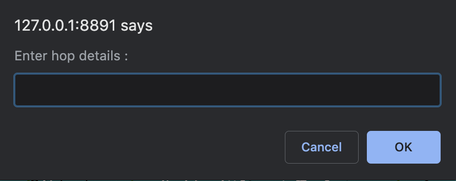

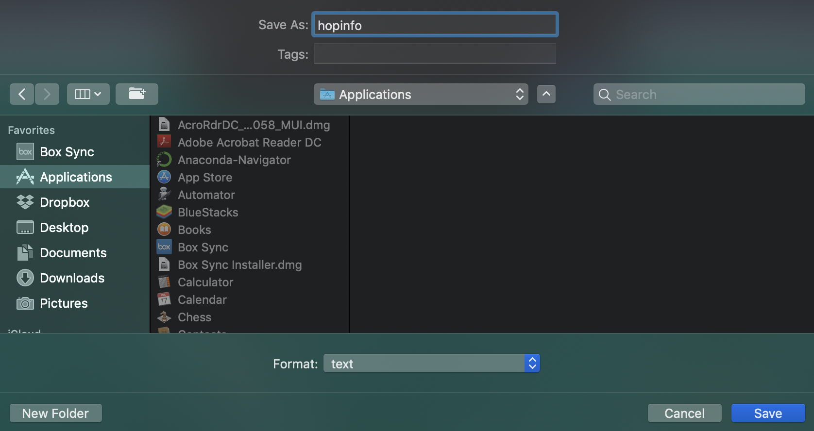

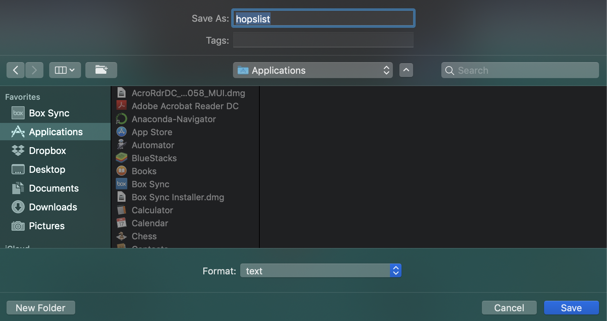

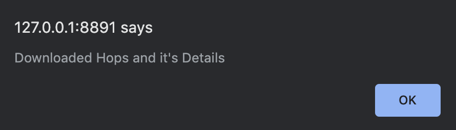

* **Undo** : If you did not mean to store a hop or accidentally clicked on the plot, use this to remove that hop.

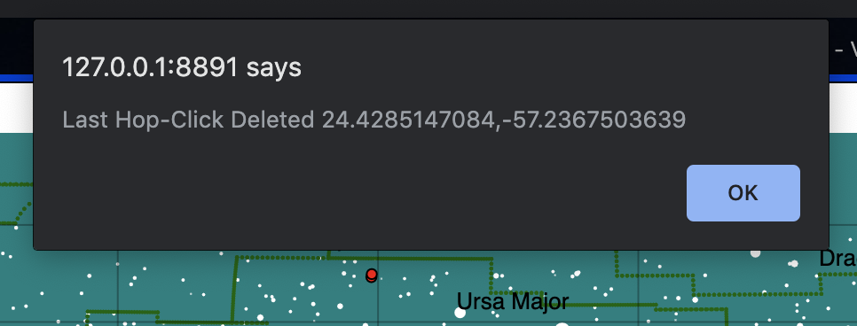

* **Clear All** : Click this to reset everything and remove all the hops stored. 

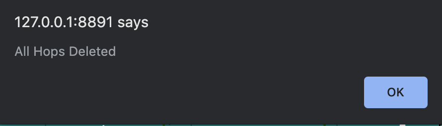

* **Hop list** : CLick this to see the updated list of hops you have created so far. The format is (RA1,DEC1 RA2,DEC2 ...)

### 3. On-screen updates
* **Deleted Hop** : After 'Undo', this will update and display the hop you just deleted. Format is (RA,DEC)
* **Last Hop** : This will show the last hop stored in the hopping sequence. Format is (RA,DEC)

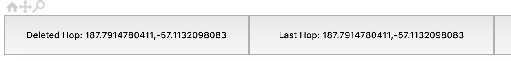

